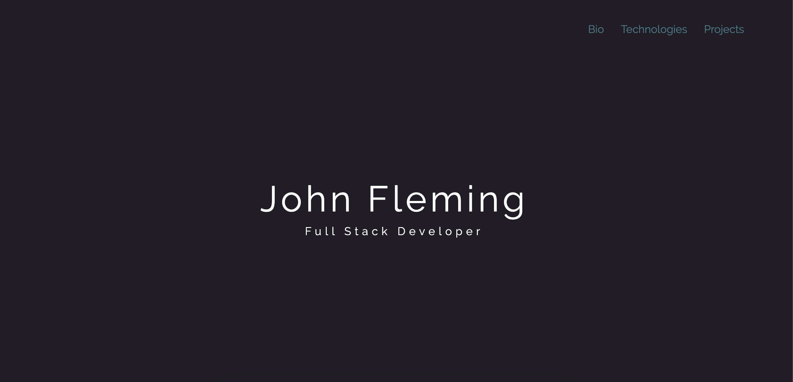
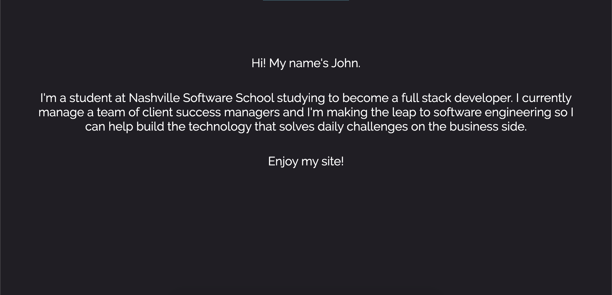
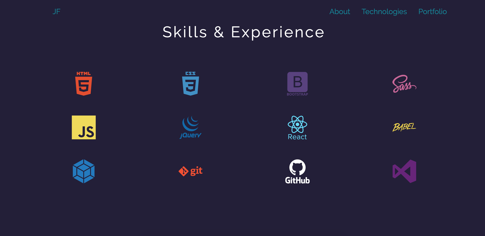
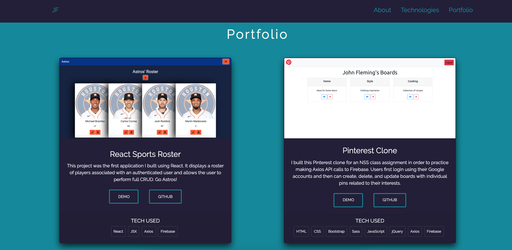

# Personal Bio Site

## Description
This project exists to showcase the progression of my developer portfolio and projects built while learing to code. 

I built the site using a combination of HTML, CSS, Bootstrap, SASS, and vanilla Javascript, hosted on Firebase. Each project was selected from group and individual assignments completed in the front end portion of the full stack developer program I participated in through Nashviille Software School. 

## Screenshots
Home section

Bio section

Technologies section

Portfolio section

## How to Run
1. Clone this repo
1. Make sure you have http-server installed via npm. If not get it [here](https://www.npmjs.com/package/http-server)
1. On your command line, run `hs -p 9999`
1. In your browser, go to `http://localhost:9999`

## Deployed Link
https://personal-bio-site-641ae.web.app/
