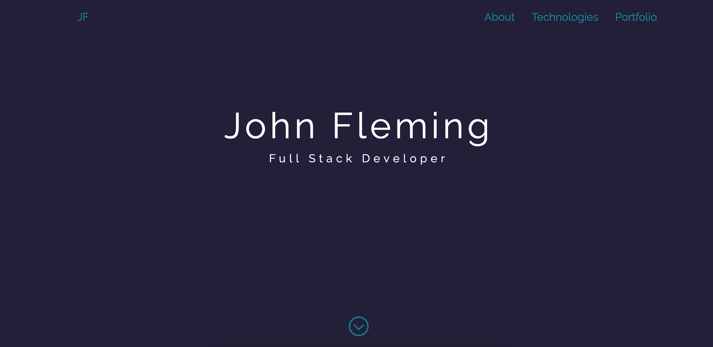
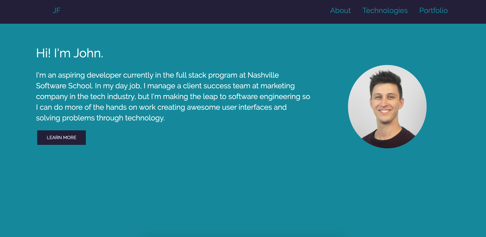

# Personal Bio Site

## Description
This project exists to showcase my developer portfolio and projects I have worked on during the course of learning to code. 

The project features vanilla HTML, CSS, and Javascript, but also makes use of Bootstrap grid system and a carousel functionality for cycling through projects I've completed. The content for the carousel is printed to the DOM from a projects array in main.js and I am using a print to DOM function and projects builder function to push available projects into the carousel code. 

## Screenshots
Home screen

Bio section

Technologies screen

Projects carousel

## How to Run
1. Clone this repo
1. Make sure you have http-server installed via npm. If not get it [here](https://www.npmjs.com/package/http-server)
1. On your command line, run `hs -p 9999`
1. In your browser, go to `http://localhost:9999`